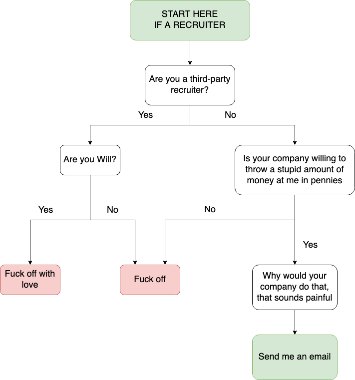

Hi- if you're on this page you're likely either a friend looking
for stuff to poke fun at me with, or a recruiter trying to figure
out if I'm:
1. Competent
2. Looking for opportunities
3. Am not a lizard person in a skin suit

I can assure you that even I don't know the answer to those questions.

Either way, welcome!

## General info
I am:

- A New York-based software engineer, currently working at **Google**
  on **Google Search** since September 2021
- A guy that can talk your ear off about everything from public transportation
  to fire codes, and be able to tie it back somehow to software engineering
- Somebody who once made [spicy rice cakes](https://www.google.com/search?q=Tteokbokki)
  without the rice cakes (don't ask)
- Canadian born, Hong Kong raised, American educated, and probably trying
  (and failing) to find something equivalent to [Wah Fung](https://goo.gl/maps/KgPHw6D6Eg2fwNCs6)'s
  quality and price (seriously, $5.50 USD for the equivalent to 2 meals of meat
  is just crazy).

### Education
Like all other people who chose to go to NYU, I too chose this great
school to learn in after getting rejected from Columbia for the 7th
time.

There may or may not be a video of me singing "Hey there Columbia" to
the tune of "Hey there Delilah" floating around somewhere.

Bachelor of Arts in Computer Science from Courant at New York University, 2017 grad.

## If you're a friend
A hint: there's 7 secrets on this site.

Message on discord if you ever find them, and I'll treat you to a drink.

## If you're a recruiter
If you are a recruiter, please see this handy-dandy flowchart I made:

My [Linkedin](https://www.linkedin.com/in/jasonyaonyu/) should be up to date
with my work history, what I've worked on, things I've lead or done, etc.

Unless there's a **lot** of pennies being thrown, I'm not looking to leave NYC,
especially since this place and Montreal are the only two cities in the world
where I can get an actually good bagel.

## Career Top Hits








