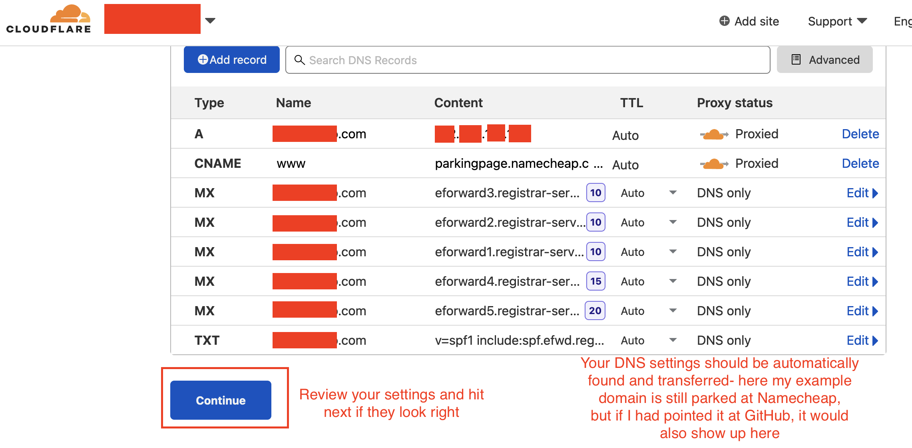

The following post contains a bunch of specific details on how I managed to
get free custom domain emails and a website on the internet with my only
ongoing cost being the domain name.

## Our goals
0. Maintenance burden should be 0- if I do absolutely nothing to maintain
   this, everything should continue to Just Work™
1. Everything must be free, or as close to 0 as humanly possible
2. Optimizations and extensions should be simple, easy, and intuitive

## Constraints
1. I _do_ want the ability to have the site versioned, so if I ever
   need to, I can revert back to an older version of a site easily
1. I _do_ want my content to be automatically optimized, so it can be
   [shared correctly on Facebook](#TODO) and show up as a [rich snippet](#TODO)
   on Google
1. I _do_ want solving for scale to be trivial, ideally in a way where it's simple to add
   in the ability to deal with theoretical spikes in traffic
1. I _do_ want custom domain emails, so I can send and receive emails from
   foobar@JasonYao.com in Gmail without having to think about it

As everybody knows, your solution to a problem is informed just as equally by
what you're _not_ solving for, as much as it is the problem itself.

1. I _don't_ need full CMS capabilities, or the ability to have dynamic
   backend functionality for my online presence (though if I do in the future
   I'd like for it to be easy to add in)
1. I _don't_ need commerce or shopping capabilities
1. I _don't_ want to have to muck about and style my site from the ground up-
   using and customizing a pre-built theme is a hard requirement, but CSS
   hurts my very smooth brain

## The chosen tech stack
|Service|Company|Cost Per Annum|
|--|--|--|
|Custom domain|[Namecheap](#TODO)|$10.86 USD|
|Custom domain email|[Mailgun](#TODO)|$0.00 USD|
|Website hosting & Continuous Deployment (CD)|[Github Pages](#TODO)|$0.00 USD|
|Continuous Integration (CI)|[TravisCI](#TODO)|$0.00 USD|
|Static site generator|[Jekyll](#TODO)|$0.00 USD|
|Content Delivery Network (CDN)|[Cloudflare](#TODO)|$0.00 USD|

**Total cost per year: $10.86 USD**

**Current Time Spent on Maintenance: 0 hours**

Here's what the network request looks like from a user


The thing to note here is that there's nothing backing the webhost here-
there's no database or microservice backing it up, since the entire website
is statically created at build time, and simply uses [Github Pages](#TODO)
to serve its content.

To actually update the content, the developer user flow looks like this
(note that everything in this diagram is automated after pushing to Github):


This setup comes with some nice benefits:
1. There's no server or services that I need to manage
1. Scaling horizontally is as simple as fronting the static content with
   1 or more CDN or any other edge server
1. Things are _fast_ since everything is pre-computed, and the only
   bottleneck to painting content for users is literally just the network.
1. Development cycle for new content is trivial, since it's just "fire and forget"
   (or in this case "push and forget").

## Setup guide
### Getting a domain
This is as simple as just going to [Namecheap](namecheap.com), searching
for a domain, and then hitting the buy button.

NOTE: Since the domain cost is the only ongoing cost with this
build, you may be tempted to take up namecheap's great deal with
paying $1.00 USD the first year for a .xyz TLD.

**DO NOT FALL FOR THIS**.



The annual renew rate for these cheap .xyz TLDs is actually around $13 USD,
meaning that you'd be paying over a 40% premium for a more sketchy-looking
domain name  compared to a regular old .com or .net TLD.

I'd suggest just getting a regular .com/.net, or one of the cheaper
annual cost [ccTLDs](https://en.wikipedia.org/wiki/Country_code_top-level_domain),
depending on which country you're from.

### Getting free custom email sending/receiving through Gmail
This one takes a little bit of setup. Let's dig in.

> 2021 April 1st editor's note: The process laid out here is no longer valid
for new users due to changes to Mailgun's pricing of their free tier. Consider
other programmatic mail providers that have a free tier instead

Danny Guo wrote up [a great walkthough](https://www.dannyguo.com/blog/using-mailgun-for-a-free-custom-domain-email-address/) on this process back in 2018, but the gist is:
1. Use any programmatic email provider with a free tier that enables
   the creation of SMTP users
1. Enable email receiving by adding in an email route to forward emails
   to your personal Gmail account
1. Enable email sending by creating an SMTP user foobar@yourdomain.com,
   and then give Gmail the username & password of your SMTP user so
   they can send emails that appear with an origin email of foobar@yourdomain.com

Mailgun's free tier in particular is really nice, since I get access to 10,000
emails a month for free- do note that this 10k number includes both sending
_and_ receiving!

Generally I'll be in the ~200 emails sent & received every month, so I'm well
within the established limits here.

### Setting up website hosting
This is the meat of our new website that we're making

Our overarching steps here will be:
1. [Create a new repo](https://github.com/new)
2. [Setup our static site generator](https://jekyllrb.com/)
3. [Setup our CI/CD pipeline](https://www.travis-ci.com/)
4. Configure [Github Pages](https://pages.github.com/) to deploy our generated static website

#### Creating a new repo
1. This should be straight-forward, with the only caveat being
   that you'll need to be particular about your repo naming
   convention, and make your name `<USER_NAME_HERE>.github.io`
   as the repo name

#### Setting up our static site generator
1. We use Jekyll here as our static site generator, and use
   a modified Jekyll theme as our starting off point for our
   website

#### Setting up our CI/CD pipeline
Our CI/CD pipeline is going to be a bit special. We're going to:
1. Set our mainline branch to be `source`, and branch off/merge in
   content into this branch
2. Create a new branch off of `source` called `publish`, and use
   this branch as the branch where we have our generated site
   created in and kept in source code
3. Create a `travis.yml` file that will "deploy" our code when
   it detects a push to the `source` branch, which will build
   the site and move all built files into the `docs/` directory
   on the `publish` branch, before pushing everything up

#### Configuring GitHub Pages to automatically deploy our site
1. Let's go ahead and in our created repo hit the `Settings` tab

2. Once here, let's enable GitHub Pages, and point it to
   our deployment branch that we're committing to

3. And we're done! Now, any time anything new is committed to the
   `publish` branch in the `docs` directory, GitHub Pages will take
   those files and publish it onto the internet for us!

### Enabling horizontal scaling through CDNs
We're going to use [Cloudflare](https://dash.cloudflare.com) as our chosen
CDN because I love their ease-of-use and how consumer-friendly they are
as a company.

1. Create a Cloudflare account if you don't have one already,
   which should pop you into the dashboard over at https://dash.cloudflare.com

2. Add in the name of your site that you want to have served by
   Cloudflare

3. Select a billing plan for this domain- the free tier is perfectly
   fine for our needs, so we shouldn't need any of the paid features
   here

4. Cloudflare has some nice automatic DNS configuration backend work,
   which should take the heavy-lifting from copy/pasting DNS
   settings from Namecheap

5. You should now be able to review and confirm your DNS settings-
   generally you wouldn't need to change anything since those
   settings are the same as what you have currently

6. Finally, we'll need to confirm our control of the domain name
   by pointing its nameservers to Cloudflare. This page shows what
   you need to do, but I've included a step-by-step just in case here.

7. Head on over to Namecheap by going to `https://ap.www.namecheap.com/domains/domaincontrolpanel/<YOUR_DOMAIN_NAME_HERE>/domain`,
   and scroll down a bit to the `Nameserver` section for your domain

8. Change your nameservers to point to Cloudflare's nameservers
    - `reza.ns.cloudflare.com`
    - `scott.ns.cloudflare.com`

9. And that's it! Head back over to the Cloudflare informational page,
   and hit the `Done, check nameservers` button for Cloudflare to check
   and see if the changes have propagated out correctly

## In conclusion
Hopefully this article goes into enough depth so others can see how they too
can build a lazy, cheap, and robust solution without having to break the bank.
