The following is a more in-depth guide on why and how I swapped out
parts of my site's tech stack over time.

This first post in this small mini-series about tech stack migrations will
be about swapping out my [domain name registrar](https://en.wikipedia.org/wiki/Domain_name_registrar),
with the next post about swapping my [CI provider from Travis to GitHub](#TODO)

## What's a Domain Name Registrar and how does it relate to my domain?
So, what is a `Domain Name Registrar` in the first place? In essence,
it's just a given domain name provider that end users like you or I
can pay a fee to in order for them to create a domain name that we can use
on the internet.

> If you'd like to read more into the fascinating world of domain name
management in which I spent the past 3.5 years a part of, check out my
[domain system walkthrough series](#TODO), where we talk about the different
actors in this system, and even build a dummy DNR ourselves (to get
it actually working you'd need to pay ICANN and go through accreditation
and sign lots of contracts, which is a bit much for a blog post series).

## Why you should transfer your domain to Cloudflare

### Some history: where we were in 2017
When I first looked around the domain registrar space back a couple years
ago, I found a lot of shady sites, anti-consumer pricing mechanisms ([I'm
looking at you GoDaddy](https://news.ycombinator.com/item?id=18655630)), and
just general wonkiness when trying to use their services to, for example, point
over to [Digital Ocean](https://www.digitalocean.com/), a cheap VPS host that
I used at the time.

Namecheap was like a breath of fresh air though- there wasn't any pricing
gimmicks, pointing nameservers at somewhere else didn't take 2-3 working days,
and their support team was top notch if anything ever did come up. Plus, they
were cheaper than the other registrars that were at least semi reputable.

In total, it costs **$9.06 USD per year for a .com domain** at Namecheap. For
reference, their margin per domain per year is about $1.03 USD, whereas other
domain registrars were egging each other on to breaking the $10.00 USD per year
mark.

### Where we are now in 2021
Even though I've worked on the Domains team at Squarespace for over 3.5 years,
and built from the very first lines of code a domain name registrar from
scratch during my time there, I still have a lot of love in my heart for Namecheap
as a registrar, since they really did provide a ton of value to me when I was
a student, for [more than a fair price](https://www.namecheap.com/blog/launch-an-xyz-and-a-drone/).

However, in 2018 a nuclear bomb was dropped on the whole domain industry when
Cloudflare announced [that they were launching their own domain registrar](https://blog.cloudflare.com/cloudflare-registrar/).

The reason why the launch was such a big deal? Cloudflare was going to charge
**no additional fees** on top of the wholesale price of a given domain.

Let me repeat that.

> ****

Cue the sound of a million business execs calling up their lawyers to
see if there was any way they could stop this, as they realize that
Cloudflare was coming to eat their lunch. This was Cloudflare firing
the first shot to begin the war against the crazy pricing in the Domain
Name Registrar ecosystem, and to add additional downward pressure on prices
for end consumers like you or me.

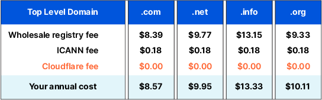

Now, before we continue, it's important that we keep the following in mind:

> ****

This fact may get lost due to some companies (cough cough Spacesquare)
attempting to imply a higher "quality of service" or "premium"-ness to their
domain offerings from their brand, but as far as you-as-a-customer are
concerned, just because some providers charge a lot more, it doesn't mean
they're actually adding anything of value for you.

At the end of the day, these offerings are all the same, and you _should_
bargain hunt for the lowest cost among reputable domain name registrars.

Here's what the breakdown looks like in table form when trying to
register the domain [HelloThereGeneralKenobi.com](https://www.youtube.com/watch?v=dQw4w9WgXcQ):

|Registrar|Price per .com domain per annum|How I feel|
|--|--|--|
|Namecheap|$9.06 USD||
|Cloudflare|$8.03 USD||
|Wix|$12.95 USD||
|GoDaddy|$18.99 USD||
|Squarespace|$20.00 USD||

For those of you that know me, you'll know one of my favorite phrases is

> ****

And so it was. That `$1.03 USD per year` in cost saving now meant something
to me, as stupid as it is to write it out. At the end of the day, domains
are essentially commodities past a certain level of expected service, which
meant that it didn't matter too much at the end of the day who was the domain
registrar for us, as long as they were reasonably reputable, and had the
lowest prices.

For the sake of the principle of the matter, I jumped ship from Namecheap for
my .com domains and migrated them all over to Cloudflare, pretty much on the
day that Cloudflare's registrar became GA. It helped that I was already
using Cloudflare anyways for their CDN and DNS offerings, so I knew that they
had a high bar for quality and wouldn't be likely to have any issues.

The only fear I have is that I haven't ever had to call into Cloudflare's
customer support before, so I have no idea if that experience would be a
positive one like at Namecheap, or if I'd be bounced around in an AI chatbot
for 30 minutes before getting to talk to an overworked human.

That uncertainty is definitely now a [known unknown](https://en.wikipedia.org/wiki/There_are_known_knowns), all for the known known benefit of having $1.03 USD
more each year to spend on dubiously clean ethnic food. That's like 1/4 of
a [cha-siu roasted pork meal at Wah Fung](https://goo.gl/maps/bMN2wKHR2GNCYVc96),
or 1/5 of a [halal meal](https://en.wikipedia.org/wiki/Halal_cart) if you swing that way.

## How to transfer your domain from Namecheap to Cloudflare
1. Head on over to your [Cloudflare dashboard](https://dash.cloudflare.com).
   you'll notice a handy-dandy button for Cloudflare's Registrar over on
   the right-hand side
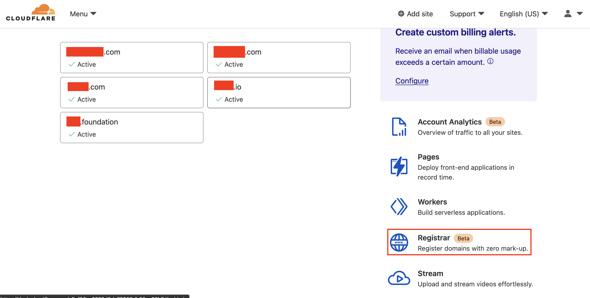

1. We're transferring our domain from Namecheap, so select the
   `Transfer` button
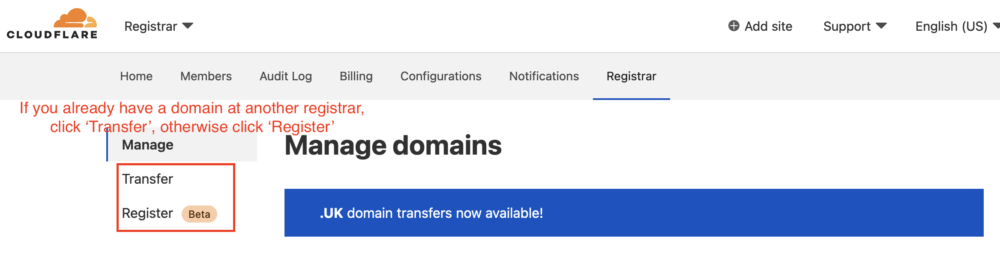

1. Since we already use Cloudflare as a CDN for this website,
   we can simply select the domain(s) that we'd like to transfer
   in, and then hit the `Confirm Domains` button
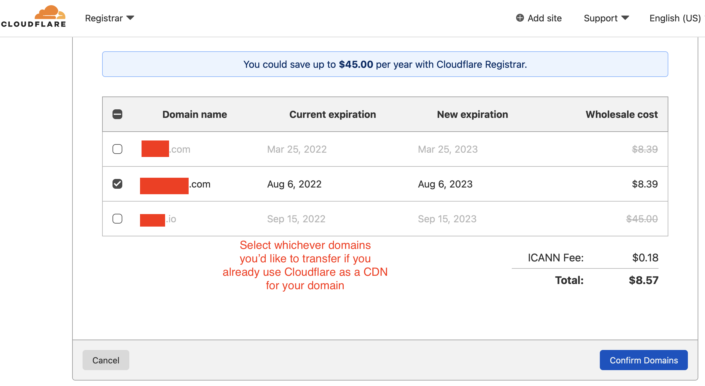

1. Now you'll see a transfer info page- open up a new tab when you get
   here (don't close this current Cloudflare tab!)
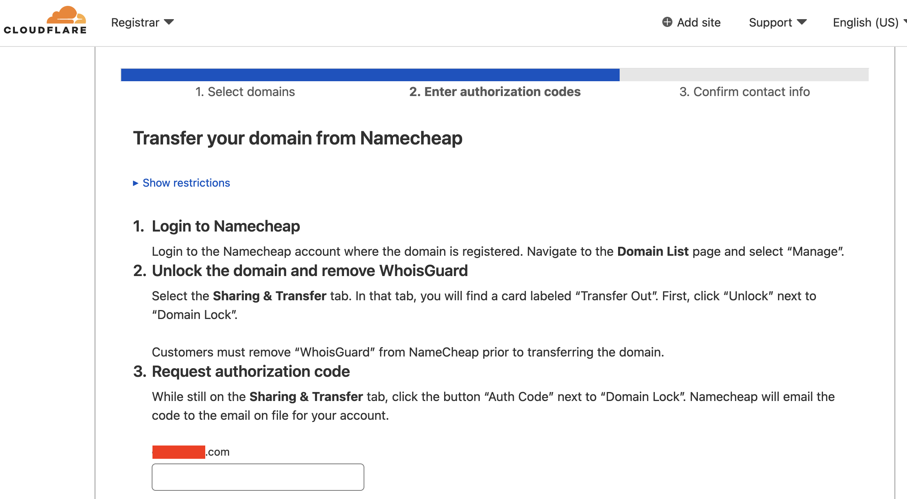

1. In your new tab, head on over to [Namecheap's domain dashboard](https://www.namecheap.com).
   If your WHOIS privacy is turned on, turn it off (I believe this step
   is required)
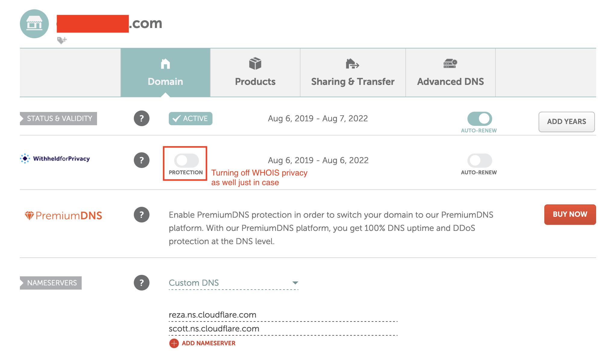

1. Click over to the `Sharing & Transfer` tab
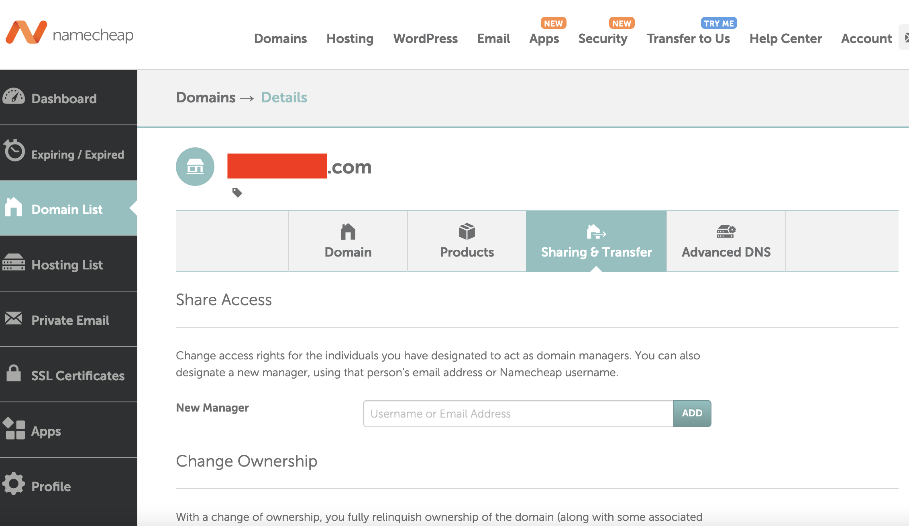

1. At the bottom of this tab, you'll see this `Transfer Out` section. Go ahead
   and click the `Unlock` button to unlock your domain for transfer
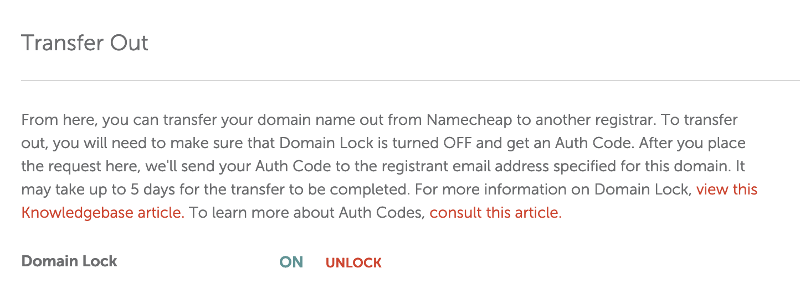

1. Then click `Auth Code`, which will bring you to this menu where
   Namecheap asks you for an optional reason for why you're leaving.
   Feel free to let them know, or tell them nothing, and then click
   the `Send Code` button
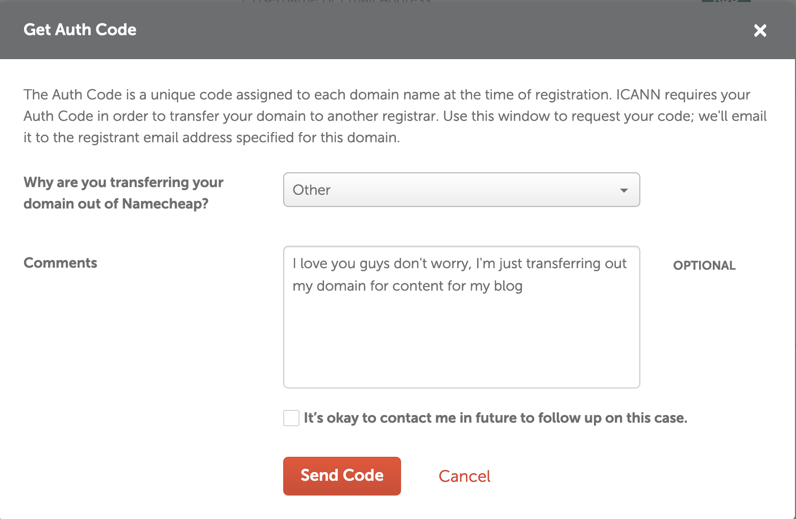

1. Head on over to your email to grab your transfer code, and copy it
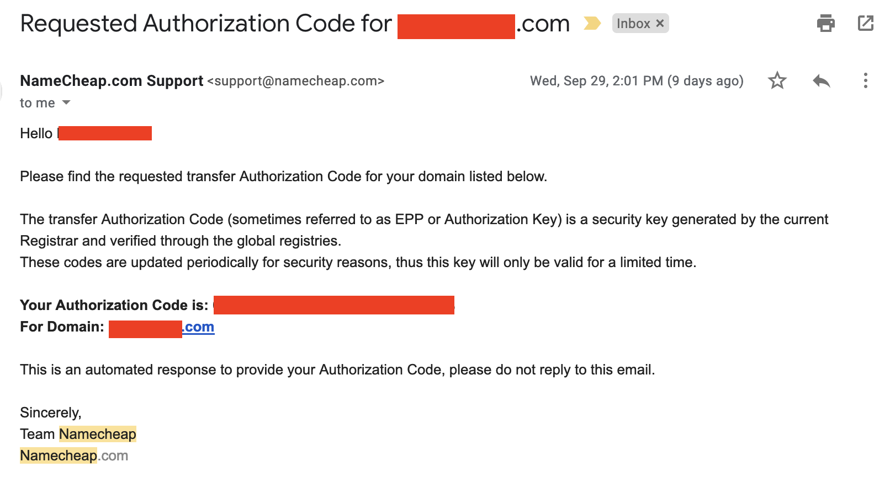

1. Then head back over to your original Cloudflare tab, paste your trasnfer
   code in, and then hit `Confirm & Proceed`
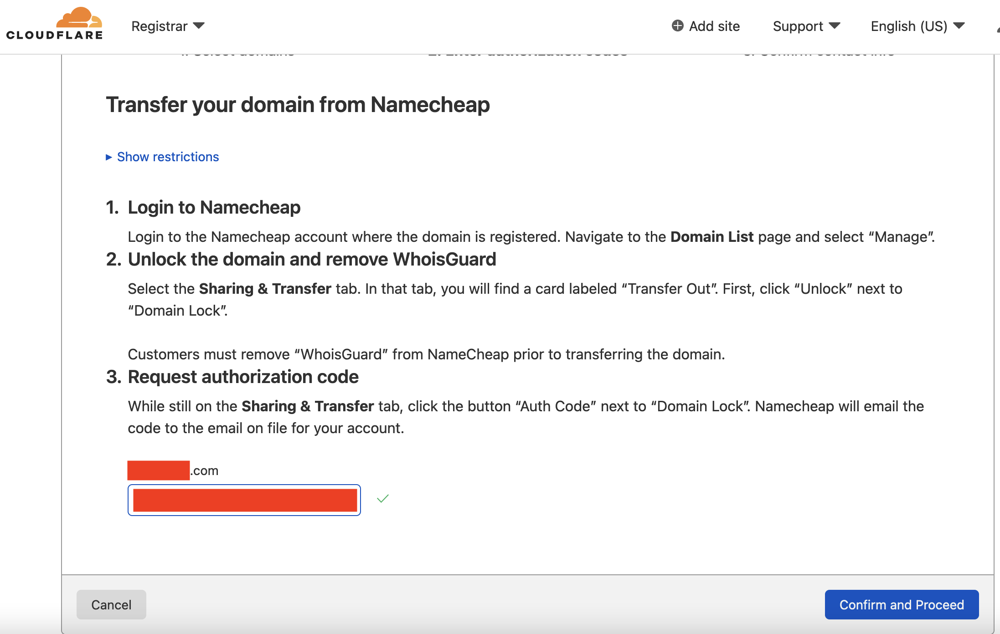

1. Fill out your contact information, and then click `Confirm and Finalize Transfer`
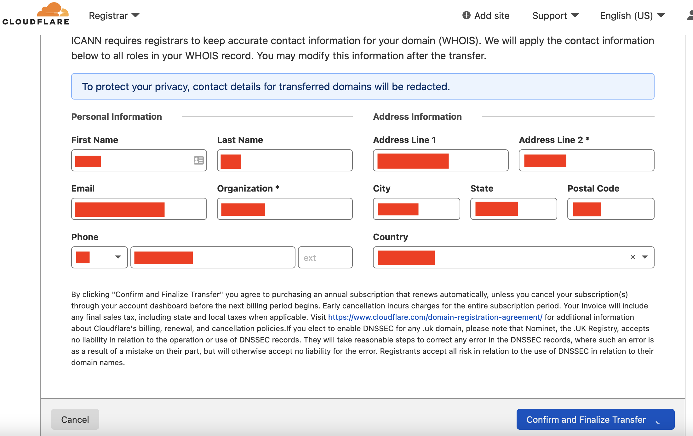

1. You're almost there! Cloudflare will send a message in the background to
   Namecheap via the Domain Name Registry in the background, but it may take
   Namecheap a couple minutes to receive the message, since it depends on their
   EPP message polling rate
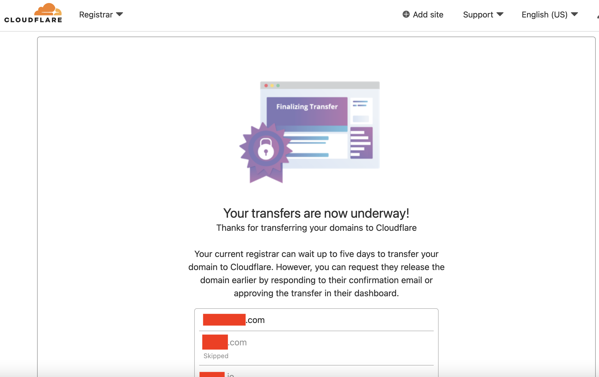

1. After about ~5-15 minutes, you'll receive an email from Namecheap saying
   that the transfer was initiated, and that it would take up to 5 days.
   **THIS IS A SHADY CUSTOMER RETENTION TACTIC**. To avoid waiting 5 days
   to transfer your domain, and just transfer now, click the link in the box
   below (yes, the message description is deliberately misleading- the page
   it brings you to will enable you to both cancel the request OR immediately
   approve the transfer, without waiting the full 5 days)
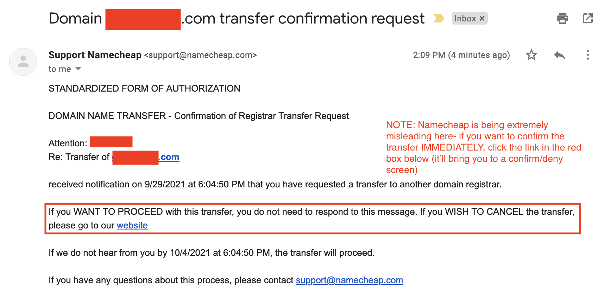

1. When you click that link, you get brought over to this selection page.
   Click the `Approve` button in order to finally confirm your domain transfer
   to Cloudflare, which should occur almost instantaneously (unless the underlying
   domain name registry is having issues).
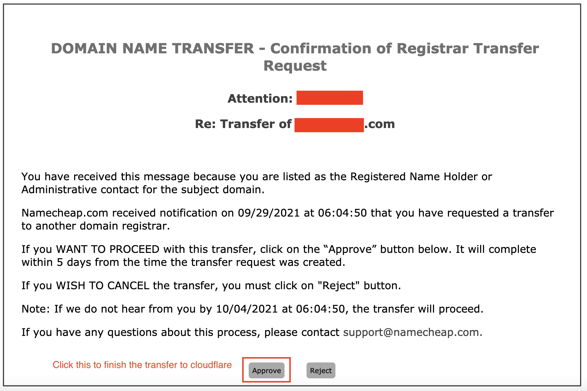

1. This last page means that you're good to go, and your domain should now
   be transferred to Cloudflare, where it'll renew without any additional
   costs going forward!
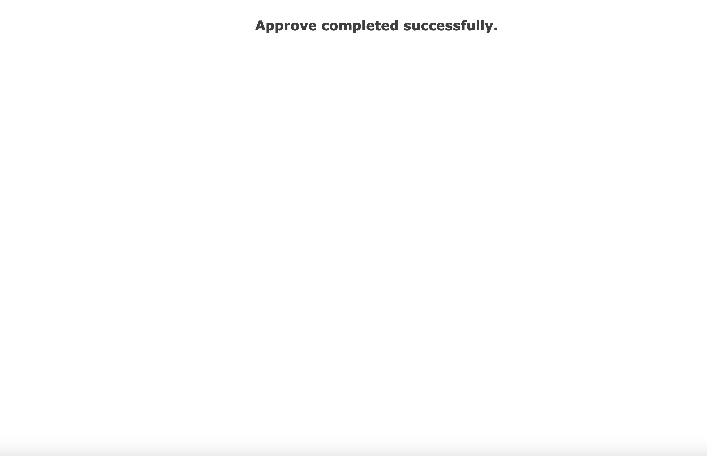

## So, what's the final verdict on migrating over to Cloudflare Registrar?
It's been 100% worth it, though do keep in mind that sometimes it's cheaper
to keep certain domains at other domain name registrars, since that registrar
may perpetually keep a TLD's price lower than the registry-cost, in order to
act as a continual loss leader to draw in customers for their other TLDs

> E.g. it's cheaper for me to keep .io domains at Namecheap than at Cloudflare,
  since even though Cloudflare is at the wholesale price, Namecheap just has
  a constant discount for .io domains by a few bucks that puts it down below
  the wholesale cost.

I won't lie, I got more than a bit of satisfaction from having a large company
like Cloudflare call it like it is, instead of pretending like most of the
domain registrar ecosystem. This quote in particular from their [blog post
announcing the launch of Cloudflare Registrar](https://blog.cloudflare.com/cloudflare-registrar/#what-consumers-hate-about-their-current-registrar)
sparked so much joy and vindication when I first read it:

> The thing is, registering a domain is a commodity. There's no meaningful
  difference between any of the existing mass market registrars. Each top
  level domain registry (TLDs like .com .org .info .io, etc) sets a wholesale
  price for registering a domain under them. These prices are known and remain
  relatively consistent over time. All the registrar does is record you as the
  owner of a particular domain. That just involves sending some commands to an
  API. In other words, domain registrars are charging you for being a middle-man
  and delivering essentially no value to justify their markup. The more we looked
  at it, the more crazy the whole market looked to us.

No, Cloudflare, you're not crazy, the world is- so thank you for launching
something to bring some sanity back to the world.
