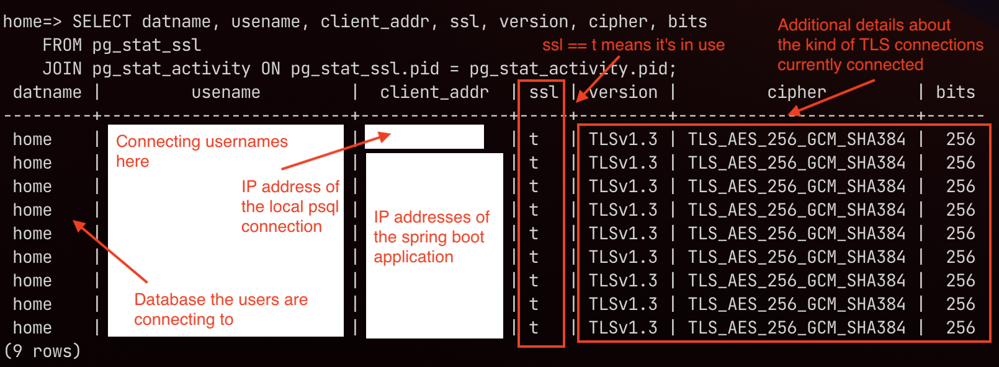
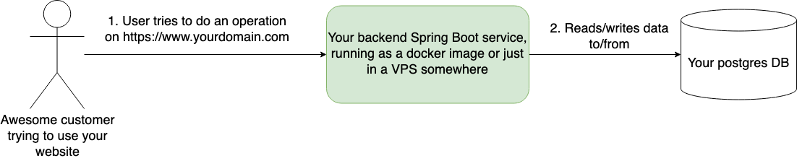
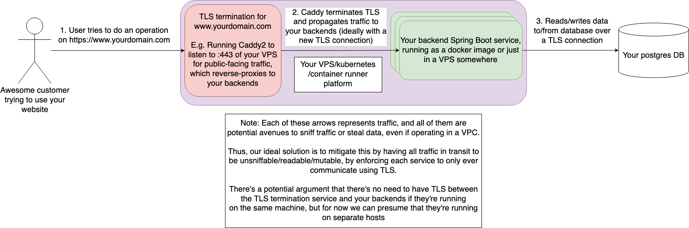
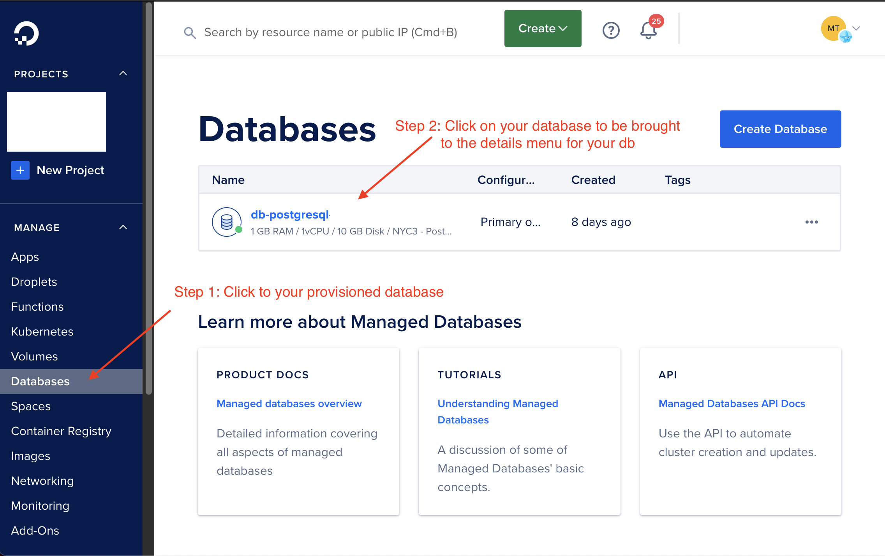
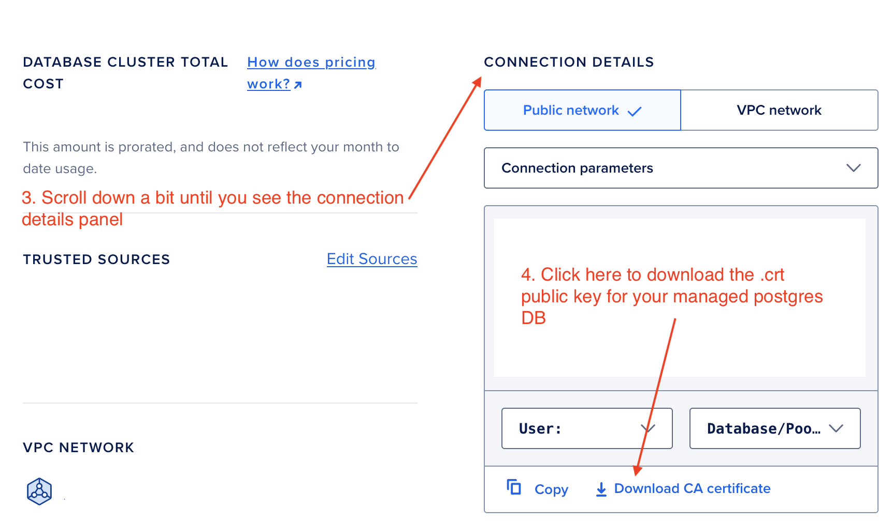
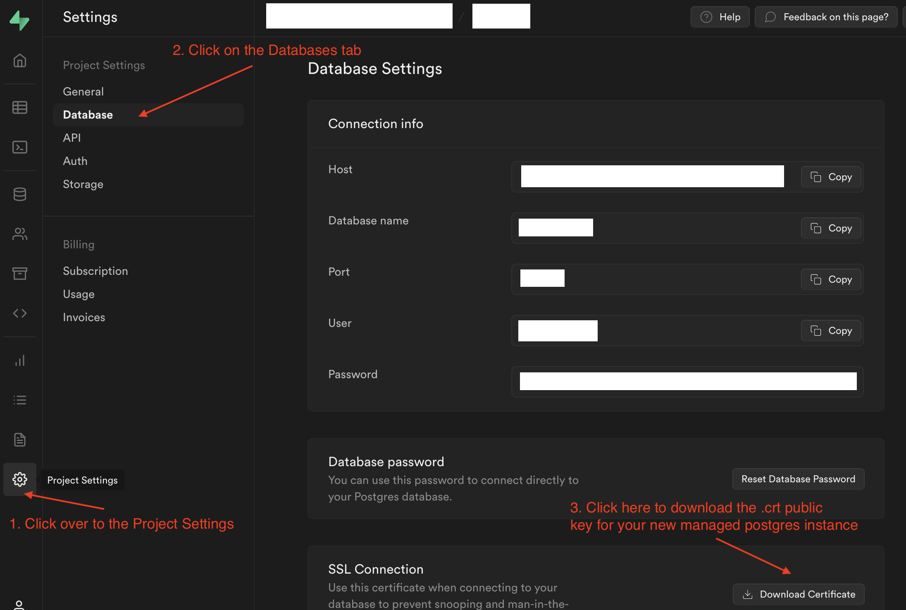
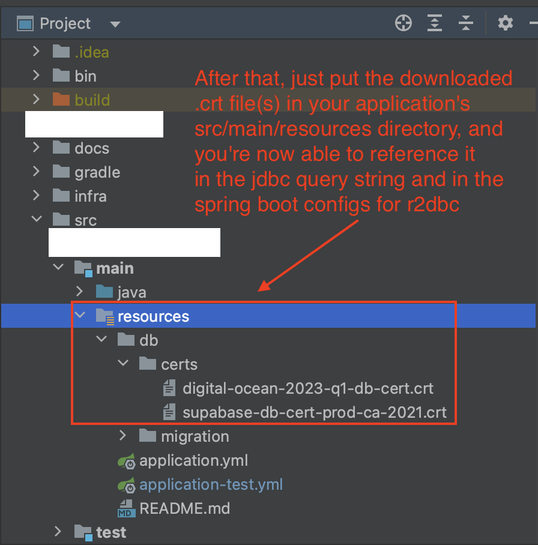

The title's a bit of a mouthful, but I wanted to write this quick snippet as both a reminder
to myself in case I ever need to do this again, or in case anybody else is in the same situation
and wondering how to get the Spring Boot `application.yaml` config wired up to always verify the
DB server's TLS cert on startup when using [r2dbc (Spring's reactive programming framework)](https://r2dbc.io/),
along with a [database migrator like Flyway](https://flywaydb.org/).

## tl;dr: A contrived example
In this example, we're pointing our spring boot application at a [managed postgres instance
running on Digital Ocean](https://www.digitalocean.com/products/managed-databases-postgresql),
and we'd like flyway migrations to run on startup automatically.

### Raw credentials in application.yml file (for illustrative purposes only)
Don't actually do this for production, use environment variables like in the second example,
the below example here is to help illustrate the specific bare minimum required to get this
all wired up properly.

Basically, the salient portion of this (and probably the reason why you're here) looks like:

```yaml
# In your src/main/resources/application.yml file
spring:
  r2dbc:
    # E.g. r2dbc:pool:postgresql://managed-db-at.digital-ocean.com:25060/home
    url: r2dbc:pool:postgresql://DB_HOST_NAME:DB_PORT_NAME/DB_NAME
    username: "your-db-service-username-here"
    password: "your-db-service-password-here"  # Please only use this to verify behavior and don't actually check this in
    properties:
      schema: example_project_schema
      sslMode: VERIFY_FULL
      # This file should be added underneath your src/main/resources directory
      # somewhere. Here, we've chosen to put it in src/main/resources/db/certs
      # for clarity, but anywhere in that resources directory will do.
      sslRootCert: db/certs/digital-ocean-2023-q1-db-cert.crt
  flyway:
    # NOTE: For whatever reason, flyway does not support the proper jdbc connection
    # parameters that delineates between different parameters using the `&` character.
    # Instead, we need to use the `;` character to avoid startup runtime errors, which
    # was found after hours of trawling the web over at this atlassian thread of all things:
    # https://community.atlassian.com/t5/Jira-questions/SSL-connection-between-jira-service-management/qaq-p/1944433#M518820
    #
    # So:
    # - This doesn't work:
    #   jdbc:postgresql://managed-db-at.digital-ocean.com:25060/home?ssl=true&sslmode=verify-full&sslrootcert=db/certs/digital-ocean-2023-q1-db-cert.crt
    # - But this does (note we just replaced the '&' characters with ';'):
    #   jdbc:postgresql://managed-db-at.digital-ocean.com:25060/home?ssl=true;sslmode=verify-full;sslrootcert=db/certs/digital-ocean-2023-q1-db-cert.crt
    url: jdbc:postgresql://managed-db-at.digital-ocean.com:25060/home?ssl=true;sslmode=verify-full;sslrootcert=db/certs/digital-ocean-2023-q1-db-cert.crt
    user: ${spring.r2dbc.username}
    password: ${spring.r2dbc.password}
    schemas: ${spring.r2dbc.properties.schema}
    baseline-on-migrate: true
```

### The recommended way with environment variables
```yaml
# In your src/main/resources/application.yml file
spring:
  r2dbc:
    url: ${DB_R2DBC_URL} # r2dbc:pool:postgresql://managed-db-at.digital-ocean.com:25060/home
    username: ${DB_SERVICE_USERNAME} # your-db-service-username-here
    password: ${DB_SERVICE_PASSWORD} # your-db-service-password-here
    properties:
      schema: example_project_schema
      sslMode: VERIFY_FULL
      sslRootCert: db/certs/digital-ocean-2023-q1-db-cert.crt # Or whatever you end up calling the cert name
  flyway:
    url: ${DB_FLYWAY_URL} # jdbc:postgresql://managed-db-at.digital-ocean.com:25060/home?ssl=true;sslmode=verify-full;sslrootcert=db/certs/digital-ocean-2023-q1-db-cert.crt
    user: ${spring.r2dbc.username}
    password: ${spring.r2dbc.password}
    schemas: ${spring.r2dbc.properties.schema}
    baseline-on-migrate: true
```

### Verifying the behavior
If you'd like to verify that your application actually is connecting correctly, you can run
the following commands to check:
1. Connect to the remote DB using the CLI
    ```shell
    # Run from the src/main/resources directory
    psql -h managed-db-at.digital-ocean.com \
      --set=ssl=true \
      --set=sslmode=verify-full \
      --set=sslrootcert=db/certs/digital-ocean-2023-q1-db-cert.crt \
      -p 25060 \
      -U your-db-service-username-here \
      -d home
    ```

2. Then run this command after giving the password and logging in:
    ```postgresql
    SELECT * FROM pg_stat_ssl;

    -- Or, if you want info on the client IP as well
    SELECT datname, usename, client_addr, ssl, version, cipher, bits
    FROM pg_stat_ssl
    JOIN pg_stat_activity ON pg_stat_ssl.pid = pg_stat_activity.pid;
    ```

Which looks like the following after I triggered a DB read in my Spring Boot application:



That's basically it! If you're interested in more details of everything above, feel free
to read down below.

## Diving a bit deeper with an example
At the end of the day, what we're trying to do at a **very** high level looks
something akin to this:



However, the devil's in the details, and if you're operating on sensitive data,
you're probably looking to have this data be at least encrypted in transit, if not
also at rest. Because of that, we now have to complicate our service diagram a
bit now.



For the purposes of this post, we'll be talking about that last arrow (step 3 in the diagram)
coming from our Spring Boot services to the Postgres database.

### Some definitions
* `r2dbc`: Spring's newish (released ~2020 and has a lot of support) framework to work with [reactive
  programming](https://www.baeldung.com/java-reactive-systems) in the Java/Spring/Spring Boot ecosystem
* `flyway`: A mechanism to run [database migrations](https://cloud.google.com/architecture/database-migration-concepts-principles-part-1)
   automatically against the database, which essentially keeps track of the "versions" of your data
   object model as it changes and evolves over time.
* `TLS` or `SSL`: A mechanism for two parties to communicate in a secure manner while preventing
   eavesdropping or man in the middle attacks through the use of [public key cryptography](https://en.wikipedia.org/wiki/Public-key_cryptography).
   TLS is actually the name of the protocols in use in modern-day web applications, while SSL references
   to old and insecure protocols that are out of date. While it's more accurate to say that we're
   securing communication between our Spring Boot application with TLS when talking to the database,
   you may see references to it as SSL, such as in the jdbc parameters above (e.g. with `sslmode`, `ssl`, and
   `sslrootcert`)
* `postgres`: An open source relational database that's in widespread use, and is time-tested,
  performant, and generally a pleasure to work with
* `Digital Ocean`: A [cloud offering](https://www.digitalocean.com/) that's generally pretty
  developer-friendly, and has nice abstractions to help trade a bit of money for the sake of
  convenience.
* `Supabase`: Another cloud offering

### What we just did with the above snippet
If you transplant the above snippet into a new Spring Boot application that utilizes r2dbc and flyway,
it should Just Work™ to force the connection to always use TLS to communicate when making calls to the
postgres database.

Here, we'll be presuming to use a managed cloud offering for postgres databases, with examples
from both Digital Ocean and Supabase, however the above steps could be pretty generalizable to
any other public cloud offering for managed postgres databases.

### Getting the .crt file from Digital Ocean





### Getting the .crt file from Supabase


### Putting this all together
Finally, you'll need to make the downloaded .crt public key(s) referencable
by both Spring Boot r2dbc configuration parameters, and the flyway jdbc
connection string. In order to do that, just move those .crt files to the
`src/main/resources` directory somewhere, and you're now good to go!


