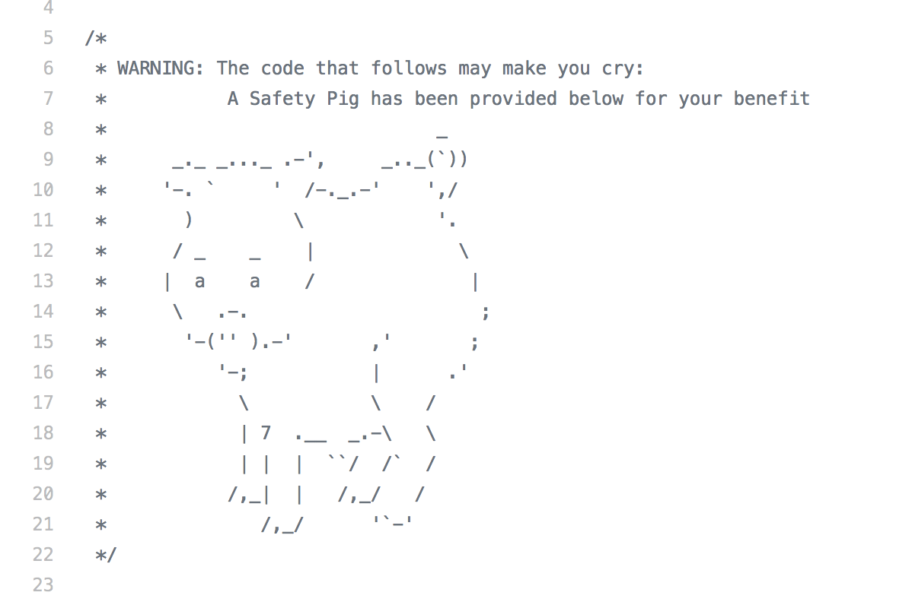

Safety pig, safety pig, does whatever safety pig does

```
    The road ahead is dangerous, a safety pig is provided
    to guide you along your journey!
    _._ _..._ .-',     _.._(`))
    '-. `     '  /-._.-'    ',/
      )         \            '.
     / _    _    |             \
    |  a    a    /              |
    \   .-.                     ;
     '-('' ).-'       ,'       ;
        '-;           |      .'
           \           \    /
           | 7  .__  _.-\   \
           | |  |  ``/  /`  /
          /,_|  |   /,_/   /
             /,_/      '`-'
```

Secret #1: A bit of a gimme secret to kickstart
you on the path to peeling back the different
layers on this ~~onion~~ website.

History: This safety pig showed up over at [r/ProgrammerHumor](https://www.reddit.com/r/ProgrammerHumor/comments/7m6ynb/safety_pig_solves_problems/)
back in 2017, and seemed fun enough to include back then. He has been a
stalwart companion to this website, and now blesses your own code to always
be bug free and without issue!

The original screenshot:


